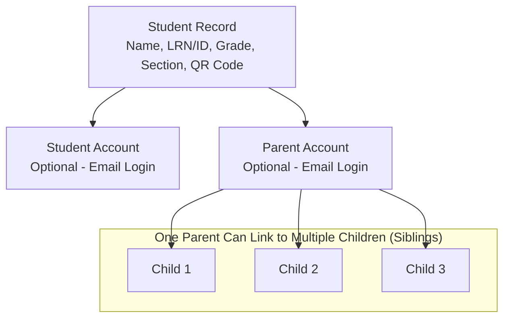
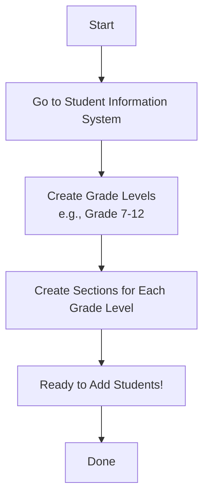
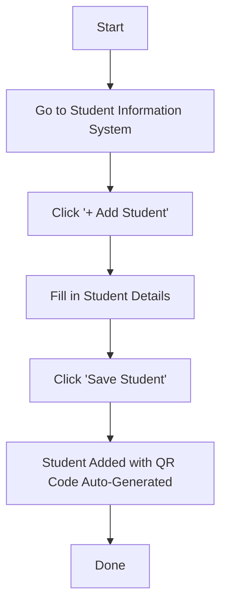
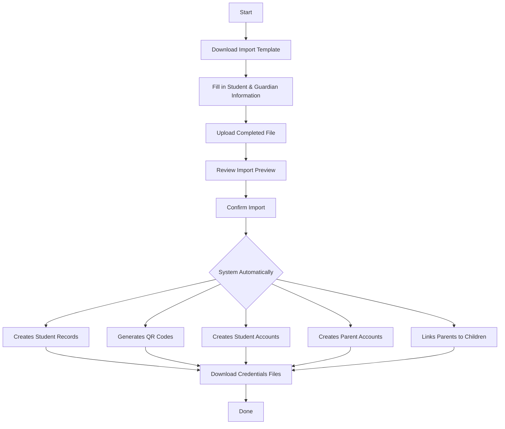
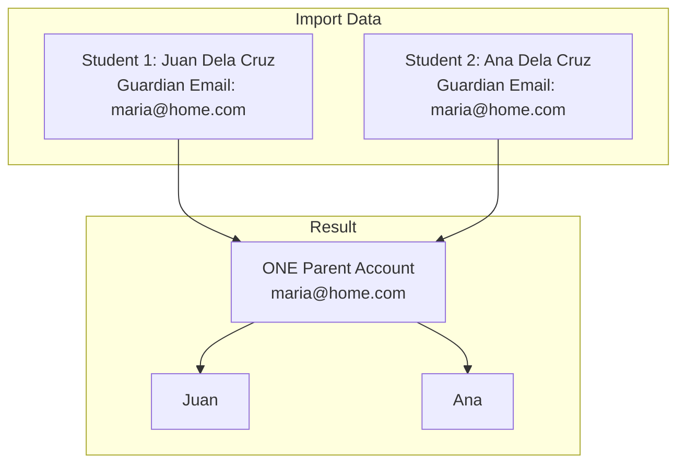
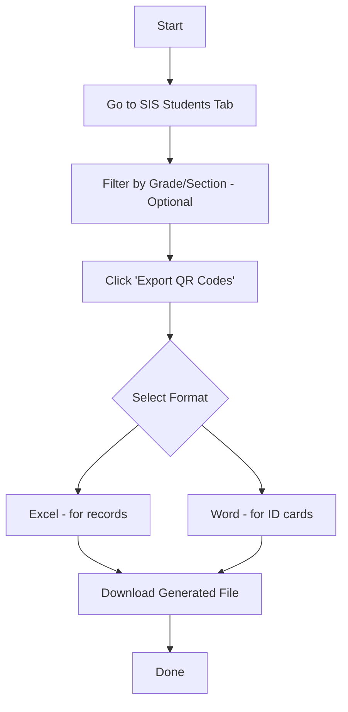

# Student & Parent/Guardian Registration Guide

## School Management System

**Version 1.0** | **December 2025**

---

## Table of Contents

1. [Introduction](#introduction)
2. [Understanding the Relationship](#understanding-the-relationship)
3. [Before You Begin: Setting Up Levels & Sections](#before-you-begin-setting-up-levels--sections)
4. [Flow 1: Adding a Single Student](#flow-1-adding-a-single-student)
5. [Flow 2: Bulk Import Students & Guardians](#flow-2-bulk-import-students--guardians)
6. [Flow 3: Managing Parent/Guardian Accounts](#flow-3-managing-parentguardian-accounts)
7. [Flow 4: Student QR Code Generation](#flow-4-student-qr-code-generation)
8. [Flow 5: First-Time Login for Students & Parents](#flow-5-first-time-login-for-students--parents)
9. [Quick Reference Cards](#quick-reference-cards)
10. [Frequently Asked Questions](#frequently-asked-questions)
11. [Troubleshooting Guide](#troubleshooting-guide)

---

## Introduction

This guide covers the complete process of registering **students** and their **parents/guardians** in the School Management System.

### Key Features

| # | Feature | Description |
|---|---------|-------------|
| 1 | **Register students with academic information** | Name, Grade Level, Section, Student ID |
| 2 | **Create parent/guardian accounts automatically** | During student import |
| 3 | **Link parents to their children** | One parent can have multiple children |
| 4 | **Generate unique QR codes for each student** | Used for event attendance scanning |
| 5 | **Provide separate login access** | For students and parents |

---

## Understanding the Relationship

### How Students, Parents, and Accounts Connect

### Key Concepts

| Concept | Explanation |
|---------|-------------|
| **Student Record** | Basic information about the student (always created) |
| **Student Account** | Optional login access for the student (requires email) |
| **Parent Account** | Optional login access for the parent/guardian (requires email) |
| **Linking** | Connects a parent account to one or more student records |
| **QR Code** | Unique identifier generated for each student automatically |

---

## Before You Begin: Setting Up Levels & Sections

### Why This Matters

Before registering students, you need to set up the **Grade Levels** and **Sections** in your school. This ensures students are properly organized.

### Setup Flow

### Creating Grade Levels

**Step 1: Navigate to SIS**
1. Log in as Administrator
2. Click **"Student Information"** or **"SIS"** from the main menu

**Step 2: Create Grade Levels**
1. Look for **"Manage Levels"** or the settings area
2. Click **"+ Add Level"**
3. Enter the level name (e.g., "Grade 7", "Grade 8")
4. Repeat for all grade levels in your school

**Example Grade Levels:**

| Grade Level |
|-------------|
| Grade 7 |
| Grade 8 |
| Grade 9 |
| Grade 10 |
| Grade 11 |
| Grade 12 |

**Step 3: Create Sections for Each Level**
1. Select a Grade Level
2. Click **"+ Add Section"**
3. Enter the section name (e.g., "Section A", "Section B")
4. Repeat for all sections in that grade level

**Example: Grade 10 Sections**

| Grade | Sections |
|-------|----------|
| Grade 10 | Section A, Section B, Section C, Section D |

---

## Flow 1: Adding a Single Student

### When to Use This?
- Enrolling a new student mid-year
- Adding a transfer student
- Making corrections to individual records

### Process Flow

### Student Registration Form Fields

| Field | Required | Description |
|-------|----------|-------------|
| **Full Name** | Yes | Complete name of the student |
| **Grade Level** | Yes | Select from available levels |
| **Section** | No | Select from available sections (can leave blank) |
| **LRN / Student ID** | No | Learner Reference Number or school ID (auto-generated if blank) |
| **Guardian Phone** | No | Contact number for emergencies |
| **Guardian Email** | No | Contact email (for reference only - does NOT create account) |
| **Status** | No | Active (default), Inactive, or Pending |

> **Important:** Adding a single student does NOT automatically create a parent account. For automatic account creation, use the Bulk Import feature.

---

## Flow 2: Bulk Import Students & Guardians

### When to Use This?
- Beginning of school year enrollment
- Importing student lists from DepEd/other systems
- Registering an entire batch of students with their parents

### What Makes This Special?

When you import students via Excel/CSV, the system can:

| # | Automatic Feature |
|---|-------------------|
| 1 | Create **student records** for all students |
| 2 | Generate **QR codes** for each student |
| 3 | Create **student accounts** (if Student Email provided) |
| 4 | Create **parent accounts** (if Guardian Email provided) |
| 5 | **Link parents to children** automatically |
| 6 | Detect **siblings** (same guardian email = same parent account) |

### Complete Bulk Import Process

### Step 1: Download the Import Template

1. Go to **Student Information System (SIS)**
2. Click **"Bulk Import"** button
3. Click **"Download Template"**
4. Save the Excel file to your computer

### Step 2: Understanding the Template Columns

#### Student Information (Required for all students)

| Column | Header | Required | Description |
|--------|--------|----------|-------------|
| A | ID / LRN | No | Student ID or Learner Reference Number (auto-generate if blank) |
| B | First Name | **Yes** | Student's first name |
| C | Middle Name | No | Student's middle name |
| D | Last Name | **Yes** | Student's last name |
| E | Grade / Level | **Yes** | Must match existing level name (e.g., "Grade 10") |
| F | Section | No | Must match existing section name (leave blank for "Unassigned") |

#### Account Creation (Optional)

| Column | Header | Required | Description |
|--------|--------|----------|-------------|
| G | Student Email | No | If provided, creates a STUDENT login account |

#### Guardian Information (Optional)

| Column | Header | Required | Description |
|--------|--------|----------|-------------|
| H | Guardian First Name | No | Parent/guardian's first name |
| I | Guardian Middle Name | No | Parent/guardian's middle name |
| J | Guardian Last Name | No | Parent/guardian's last name |
| K | Guardian Phone | No | Contact phone number |
| L | Guardian Email | No | If provided, creates a PARENT login account. Same email = same parent account for siblings |

### Step 3: Sample Import Data

| ID/LRN | First Name | Middle | Last Name | Grade | Section | Student Email | Guardian First | Guardian Email |
|--------|------------|--------|-----------|-------|---------|---------------|----------------|----------------|
| STU001 | Juan | Santos | Dela Cruz | Grade 10 | Section A | juan@school.edu | Maria | maria@home.com |
| STU002 | Ana | Santos | Dela Cruz | Grade 8 | Section B | ana@school.edu | Maria | maria@home.com |
| STU003 | Pedro | | Reyes | Grade 10 | Section A | pedro@school.edu | Jose | jose@home.com |
| STU004 | Lisa | | Garcia | Grade 10 | Section A | | | |

### What This Example Creates

**Student Records Created: 4**

| Student | Grade | Section | Account Created |
|---------|-------|---------|-----------------|
| Juan Santos Dela Cruz | Grade 10 | Section A | Yes (juan@school.edu) |
| Ana Santos Dela Cruz | Grade 8 | Section B | Yes (ana@school.edu) |
| Pedro Reyes | Grade 10 | Section A | Yes (pedro@school.edu) |
| Lisa Garcia | Grade 10 | Section A | No (no email provided) |

**Parent Accounts Created: 2**

| Parent | Email | Linked Children |
|--------|-------|-----------------|
| Maria Dela Cruz | maria@home.com | Juan AND Ana (siblings share parent) |
| Jose Reyes | jose@home.com | Pedro |

> **Note:** Lisa Garcia has NO parent account (no guardian email was provided)

### Step 4: Upload and Import

1. Return to the **SIS** page
2. Click **"Bulk Import"**
3. Click **"Choose File"** or drag-and-drop your completed Excel file
4. The system will show a preview of the data
5. Review for any errors (highlighted in red)
6. Click **"Import Students"**

### Step 5: Download Credentials

After successful import, a **credentials banner** appears. You MUST download these files!

> **IMPORTANT:** These passwords will NOT be shown again!

| Download Button | Contains |
|-----------------|----------|
| Download Student Credentials | Student accounts with temporary passwords |
| Download Parent Credentials | Parent accounts with temporary passwords |

**Student Credentials File Format:**

| Student Name | Email | Temporary Password |
|--------------|-------|-------------------|
| Juan Santos Dela Cruz | juan@school.edu | Abc123Xyz789!@# |
| Ana Santos Dela Cruz | ana@school.edu | Def456Uvw012$%^ |
| Pedro Reyes | pedro@school.edu | Ghi789Rst345&*( |

**Parent Credentials File Format:**

| Guardian Name | Email | Temporary Password | Linked Students |
|---------------|-------|-------------------|-----------------|
| Maria Dela Cruz | maria@home.com | Jkl012Mno!@# | Juan; Ana |
| Jose Reyes | jose@home.com | Pqr345Stu$%^ | Pedro |

### Sibling Handling (Same Parent, Multiple Children)

The system automatically recognizes siblings by **matching Guardian Email**:

---

## Flow 3: Managing Parent/Guardian Accounts

### Viewing All Parents

1. Go to **Student Information System (SIS)**
2. Click on the **"Parents"** tab
3. View the list of all parent/guardian accounts

**Parents List View:**

| Parent Name | Email | Children | Status | Actions |
|-------------|-------|----------|--------|---------|
| Maria Dela Cruz | maria@home.com | 2 | Active | Edit |
| Jose Reyes | jose@home.com | 1 | Active | Edit |
| Carmen Santos | carmen@mail.com | 1 | Inactive | Edit |

### Editing a Parent/Guardian

Click **"Edit"** next to a parent to:
- Update their name
- Change their email
- Activate or deactivate their account
- View their linked children

---

## Flow 4: Student QR Code Generation

### Understanding QR Codes

Every student automatically receives a **unique QR code** when registered.

| Feature | Description |
|---------|-------------|
| Unique | Each student has a different QR code |
| Auto-generated | Created automatically when student is registered |
| Tamper-proof | Cannot be duplicated or forged |
| Event scanning | Used for attendance at school events |
| Regenerates | New QR code generated if Student ID changes |

### Exporting QR Codes

You can export QR codes in two formats:

| Format | Best For | Contents |
|--------|----------|----------|
| **Excel** | Records and digital use | LRN, Student Name, Grade, Section, QR Image |
| **Word** | Printing ID cards (3 per page) | QR Code, Name, ID, Grade-Section |

### How to Export QR Codes

---

## Flow 5: First-Time Login for Students & Parents

### For Students

| Step | Action |
|------|--------|
| 1 | **Receive credentials** from school (email + temporary password) |
| 2 | **Go to login page** - Open browser, navigate to school system URL |
| 3 | **Enter credentials** - Email and temporary password, click "Sign In" |
| 4 | **Access dashboard** - View events, attendance records, profile |
| 5 | **Change password** (Recommended) - Profile > Security > Change Password |

### For Parents/Guardians

| Step | Action |
|------|--------|
| 1 | **Receive credentials** from school (email + temporary password + linked children list) |
| 2 | **Go to login page** - Open browser, navigate to school system URL |
| 3 | **Enter credentials** - Email and temporary password, click "Sign In" |
| 4 | **Access dashboard** - View all linked children, events, RSVP, attendance records |
| 5 | **Change password** (Recommended) - Profile > Security > Change Password |

---

## Quick Reference Cards

### For Administrators: Student Registration

| Task | Steps |
|------|-------|
| **Setup (One-Time)** | SIS > Create Levels > Create Sections for each Level |
| **Add Single Student** | SIS > + Add Student > Fill Form > Save (No account created, just student record) |
| **Bulk Import with Accounts** | SIS > Bulk Import > Download Template > Fill Excel > Upload > Import > Download Credentials (Creates students + accounts + links parents) |
| **Export QR Codes** | SIS > Filter by Grade/Section > Export QR Codes > Choose Excel or Word > Download |
| **Manage Parents** | SIS > Parents Tab > Search/Edit Parent > Save |

### For Staff: Distributing Credentials

| Step | Action |
|------|--------|
| 1 | Download BOTH credential files immediately (Student + Parent) |
| 2 | Store files SECURELY (do not email unencrypted, do not post publicly) |
| 3 | Distribute via: Printed slips (sealed envelope), In-person handout, Official school channel |
| 4 | Instruct recipients to: Change password on first login, Keep credentials private |

> **Warning:** Passwords are ONE-TIME VISIBLE. If lost, admin must reset password.

### For Students: First Login

| Item | Details |
|------|---------|
| **You will receive** | Your email (e.g., juan@school.edu) + Temporary password |
| **To login** | Go to school system URL > Enter email > Enter password > Click "Sign In" |
| **After login** | Go to Profile > Change password to something memorable (12+ chars, mixed case, number) |
| **Forgot password?** | Contact your school administrator |

### For Parents: First Login

| Item | Details |
|------|---------|
| **You will receive** | Your email + Temporary password + List of linked children |
| **To login** | Go to school system URL > Enter email > Enter password > Click "Sign In" |
| **What you can do** | View all children's info, See events, RSVP for children, View attendance |
| **Multiple children?** | All children appear in ONE account - no separate logins needed |
| **Forgot password?** | Contact your school administrator |

---

## Frequently Asked Questions

| Question | Answer |
|----------|--------|
| **Can a student exist without a login account?** | YES. A student record (name, grade, section, QR code) is always created. A login account is only created if an email is provided during import. |
| **Can a parent have multiple children linked?** | YES. If multiple students share the same Guardian Email in the import file, they are automatically linked to ONE parent account. |
| **What if I forget to download the credentials?** | The temporary passwords are shown only ONCE. If not downloaded, an administrator must reset the password for each affected user. |
| **Can I import students without creating parent accounts?** | YES. Simply leave the Guardian Email column blank. The student record will be created, but no parent account will be made. |
| **What if the Level/Section doesn't exist?** | The import will FAIL for that row. Make sure all Levels and Sections are created BEFORE importing students. |
| **Can I edit a student's information after import?** | YES. Click on any student in the SIS list to edit their information (name, grade, section, status). |
| **Does changing a student's ID regenerate their QR code?** | YES. If you change the Student ID/LRN, a new unique QR code is automatically generated. |
| **Can two parents be linked to the same child?** | YES. Import the student twice with different guardian emails, or manually create additional links. |

---

## Troubleshooting Guide

### Common Import Errors

| Error | Cause | Fix |
|-------|-------|-----|
| **"Level not found"** | Grade/Level name in Excel doesn't match any existing level | Check spelling. Use exact level names (e.g., "Grade 10" not "Gr. 10") |
| **"Section not found"** | Section name doesn't exist for that Grade Level | Create the section first, or leave blank for "Unassigned" |
| **"Duplicate student ID"** | A student with the same LRN/ID already exists | Use a different ID, or leave blank to auto-generate |
| **"Invalid email format"** | Email address is not in valid format | Use proper format: name@domain.com |
| **"Email already exists"** | An account with this email already exists | Use a different email, or leave blank to skip account creation |

### Login Issues

| Problem | Solutions |
|---------|-----------|
| **"Invalid credentials"** | Check email spelling (case-sensitive), Copy-paste password (don't type), Make sure Caps Lock is off, Contact admin for password reset |
| **"Account is inactive"** | Contact administrator to reactivate account |
| **Parent can't see all children** | Children may have different guardian emails. Contact admin to link missing children to your account |

---

## Appendix: Complete Template Column Reference

| Column | Header Name | Required | Description | Example |
|--------|-------------|----------|-------------|---------|
| A | ID / LRN | No | Student ID (auto-generated if blank) | STU001 |
| B | First Name | **Yes** | Student's first name | Juan |
| C | Middle Name | No | Student's middle name | Santos |
| D | Last Name | **Yes** | Student's last name | Dela Cruz |
| E | Grade / Level | **Yes** | Must match existing level | Grade 10 |
| F | Section | No | Must match existing section | Section A |
| G | Student Email | No | Creates student account if provided | juan@school.edu |
| H | Guardian First Name | No | Parent's first name | Maria |
| I | Guardian Middle Name | No | Parent's middle name | |
| J | Guardian Last Name | No | Parent's last name | Dela Cruz |
| K | Guardian Phone | No | Contact number | +63 912 345 6789 |
| L | Guardian Email | No | Creates parent account if provided | maria@home.com |

---

**Document Prepared For:** User Verification Process

**System:** School Management System - Student Information System (SIS)

**Version:** 1.0 | **Date:** December 2025

---
